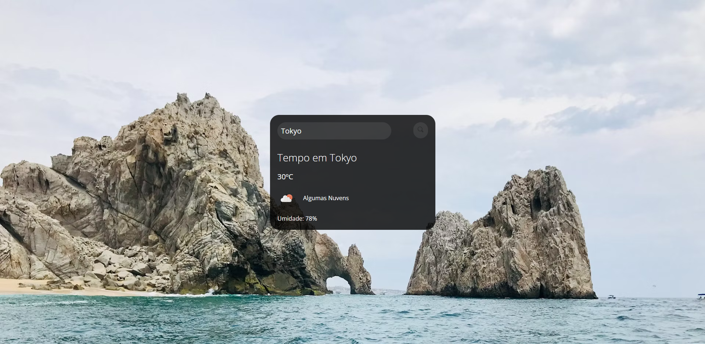

<h1 align="center"> Dev-Previsão </h1>

Este projeto mostra a previsão do tempo com base na cidade pesquisada através de uma API.

  <a href="#-tecnologias">Tecnologias</a>&nbsp;&nbsp;&nbsp;|&nbsp;&nbsp;&nbsp;
  <a href="#-projeto">Projeto</a>&nbsp;&nbsp;&nbsp;&nbsp;&nbsp;&nbsp;

 

  

## 🚀 Tecnologias

Esse projeto foi desenvolvido com as seguintes tecnologias:

- HTML e CSS
- JavaScript
- Git e Github
- API

## 💻 Projeto

O Dev-Previsão é um apresentador de previsões.

---

